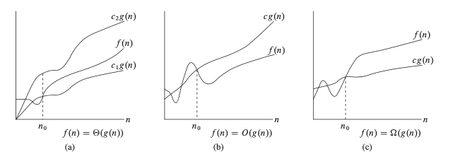

# Asymptotic Analysis

## Formal definitions of Big O, Big Omega, and Big Theta

Image source: *Introduction to Algorithms, 3rd Edition, by Thomas H. Cormen, Charles E. Leiserson, Ronald L. Rivest, and Clifford Stein*

- (a) Big Theta (Θ)
- (b) Big O (O)
- (c) Big Omega (Ω)

**Big O**

$$
f(n) = O(g(n))
$$

$$
0 \leq f(n) \leq c \cdot g(n) \quad \text{for all} \quad n \geq n_0, C > 0
$$

* Represents an upper bound on the growth rate of a function.
* Indicates $f(n)$ doesn’t grow faster than $g(n)$, up to a constant factor, for large $n$.
* It is not the same as the worst-case scenario (time or space complexity), it is just an upper bound, although in practice it's often associated with the worst-case scenario.
* It is an upper bound, but not necessarily the tightest one. It accepts any function that will eventually become an upper bound for sufficiently large $n$. The tightest upper bound is the one that grows as close as possible to $f(n)$.

Let's consider $f(n) = 3n + 10$. The following two statements are true:

1. $f(n) = O(n)$
2. $f(n) = O(n^2)$

However,$O(n)$ is a tighter bound than $O(n^2)$ because $n$ grows closer to $f(n)$ than $n^2$ does as $n$ increases.
