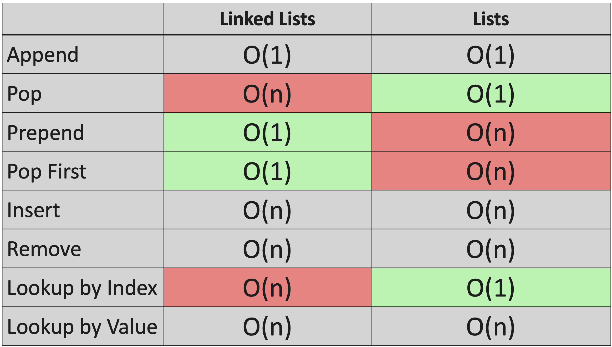

# Linked Lists
- Linked lists are not based on indexes.
- The elements of a normal Python's list are contiguous
in memory (next to each other), whereas the nodes of
a linked list are spread all over the memory.
- In a linked list, there is a pointer called **HEAD** that
points to the first node and there is also a pointer
called **TAIL** that points to the last node. It is also
important to mention that a given node points to the next one,
except the last node, who points to nowhere.

# Big O

- Appending a new element at the end of the list is a `O(1)` operation.
It doesn't matter how many nodes the list has, the number of operations to add
a new node to the end of the list is constant.

- Removing an element from the end of a linked list is a `O(n)` operation.
It is necessary to go through the entire linked list to reach the node
that points to the new last node and set the new value of `TAIL`.

- Adding a new element at the beginning of a linked list
is a `O(1)` operation. It doesn't matter how many nodes the linked list
has, the number of operations needed to accomplish it remains constant.

  1. The new node points to `HEAD`
  2. `HEAD` points to the new node.

- Removing the first element of a linked list is a `O(1)` operation.

  1. Set `HEAD` to point to `HEAD.next`

- Adding a new element in the middle of a linked list is a `O(n)` operation.

- Removing an element from the middle of a linked list is a `O(n)` operation.

- Looking an element up either by value or by index is an `O(n)` operation.

The following table was extracted from the course
*Python Data Structures & Algorithms + LEETCODE Exercises*
by Scott Barrett.

